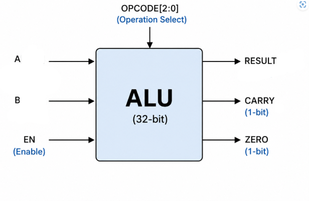
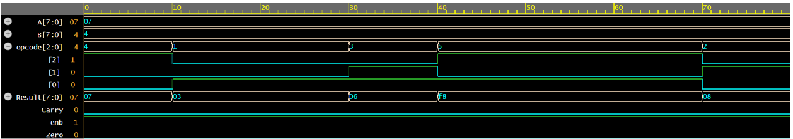

# 8-bit ALU Design using Verilog HDL

This project implements a 8-bit Arithmetic Logic Unit (ALU) using Verilog HDL. 
The ALU performs various arithmetic and logical operations based on the given opcode and generates status flags.

## Features
- 8 bit input operands (A and B)
- Supports arithmetic and logical operations
- Carry flag generation
- Zero flag detection
- Enable control for ALU operation
- Verified using a Verilog testbench with waveform simulation

  

## Operations Supported
- Addition
- Subtraction
- AND operation
- OR operation
- Compliment operation
- Other logical operations based on opcode selection

## Tools Used
- Verilog HDL
- EDA Playground
- Simulation using testbench and waveform analysis

## Files
- `design.sv` - ALU design module
- `testbench.sv` - Testbench for functional verification

## Output Verification

The design was tested with multiple input combinations and verified using simulation waveforms.
